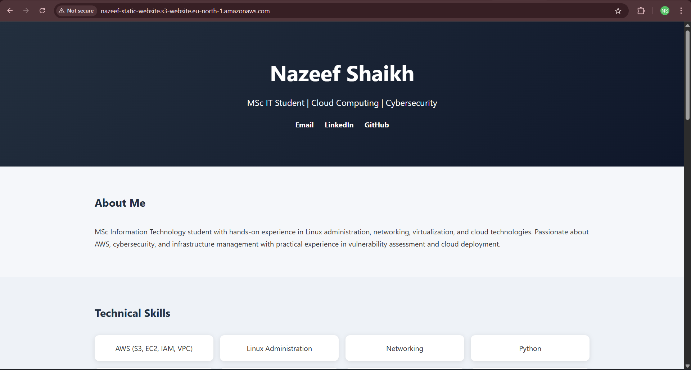
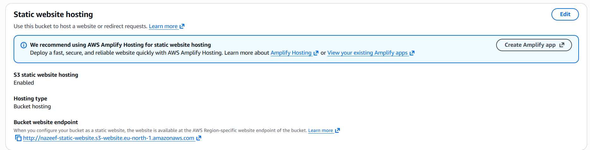

# AWS S3 Portfolio Website

A cloud-based portfolio website hosted using Amazon S3 Static Website Hosting. This project demonstrates fundamental AWS cloud concepts including storage management, static website deployment, access control configuration, and cloud-based hosting.

---

## Project Overview

This project showcases the deployment of a personal portfolio website on Amazon S3. The website was built using HTML and CSS and hosted using AWS S3 Static Website Hosting.

The objective of this project was to gain practical experience with AWS cloud services, website deployment, storage management, and access control configuration.

---

## Technologies Used

* Amazon S3
* HTML5
* CSS3
* AWS Management Console

---

## AWS Services Used

### Amazon S3

* Created and configured an S3 bucket
* Uploaded website files
* Enabled Static Website Hosting
* Configured bucket policies
* Managed public access settings

---

## Project Features

* Responsive portfolio website
* Cloud-based hosting
* Public website accessibility
* Static website deployment
* AWS S3 bucket management
* Access control configuration

---

## Website Sections

* About Me
* Technical Skills
* Experience
* Projects
* Education
* Certifications
* Contact Links

---

## Project Architecture

```text
User Browser
      │
      ▼
S3 Website Endpoint
      │
      ▼
Amazon S3 Bucket
 ├── index.html
 ├── style.css
 └── assets
```

---

## Implementation Steps

### Step 1 – Create S3 Bucket

Created an Amazon S3 bucket to store website files.

### Step 2 – Upload Website Files

Uploaded:

* index.html
* style.css

to the S3 bucket.

### Step 3 – Configure Static Website Hosting

Enabled Static Website Hosting and specified:

```text
Index document: index.html
```

### Step 4 – Configure Public Access

Disabled Block Public Access settings and configured permissions for website accessibility.

### Step 5 – Configure Bucket Policy

Added a bucket policy to allow public read access to website files.

### Step 6 – Deploy Website

Accessed the website using the generated S3 Website Endpoint.

---

## Screenshots

### Live Portfolio Website



---

### S3 Bucket Objects


---

### Static Website Hosting Configuration



---

## Skills Demonstrated

### Cloud Computing

* AWS Fundamentals
* Cloud Storage
* Static Website Deployment
* Cloud Infrastructure Basics

### AWS Services

* Amazon S3
* Static Website Hosting
* Bucket Policies
* Access Management

### Web Technologies

* HTML
* CSS
* Website Deployment

### Security Concepts

* Public Access Configuration
* Bucket Policy Management
* Access Control

---

## Learning Outcomes

Through this project I learned:

* How Amazon S3 works as a cloud storage service
* How to deploy static websites using AWS
* How to configure bucket permissions and policies
* How to manage public website access
* How cloud-based hosting differs from traditional hosting
* Fundamental AWS deployment practices

---

## Future Improvements

* Add a custom domain
* Configure HTTPS using CloudFront
* Implement CI/CD deployment using GitHub Actions
* Add AWS Route 53 integration
* Improve website UI/UX
* Add monitoring and logging

---

## Repository Structure

```text
aws-s3-portfolio-website/
│
├── index.html
├── style.css
├── README.md
├── website.png
├── s3-bucket.png
└── static-hosting.png
```

---

## Author

### Nazeef Shaikh

* LinkedIn: https://linkedin.com/in/nazeef10
* GitHub: https://github.com/NazeefShk

---

## Project Status

✅ Completed

Hosted successfully using Amazon S3 Static Website Hosting.
